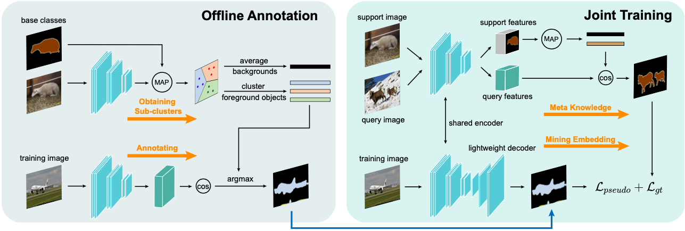

# Mining Latent Classes for Few-shot Segmentation

This is the official implementation of our paper [**Mining Latent Classes for Few-shot Segmentation**](https://arxiv.org/abs/2103.15402), ICCV 2021 Oral.

The source code will be released soon.

<div align="center">
  
</div>


## Citation

```
@article{yang2021mining,
  title={Mining Latent Classes for Few-shot Segmentation},
  author={Yang, Lihe and Zhuo, Wei and Qi, Lei and Shi, Yinghuan and Gao, Yang},
  journal={arXiv preprint arXiv:2103.15402},
  year={2021}
}
```
