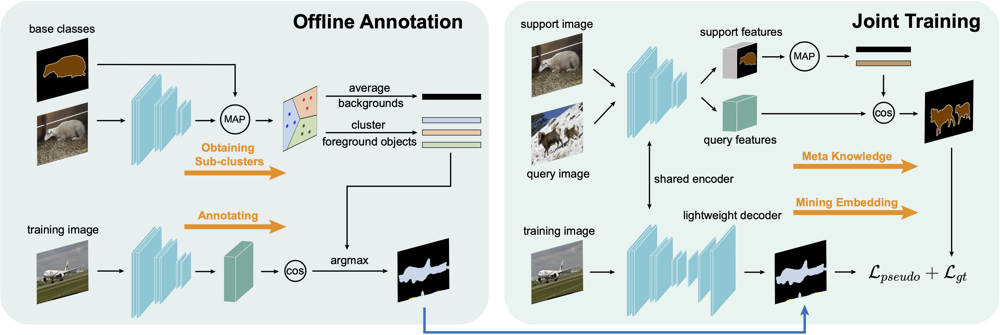

# Mining Latent Classes for Few-shot Segmentation

[Lihe Yang](https://github.com/LiheYoung), [Wei Zhuo](https://scholar.google.com.au/citations?user=Q-UjnzEAAAAJ&hl=zh-CN), [Lei Qi](http://palm.seu.edu.cn/qilei/), [Yinghuan Shi](https://cs.nju.edu.cn/shiyh/), [Yang Gao](https://cs.nju.edu.cn/gaoyang/)




The codebase contains baseline of our paper [Mining Latent Classes for Few-shot Segmentation](https://arxiv.org/abs/2103.15402), ICCV 2021 Oral.

Several key modifications to the simple yet effective metric learning framework:
- Remove the final residual stage in ResNet for stronger generalization
- Remove the final ReLU for feature matching
- Freeze all the BatchNorms from ImageNet pretrained model


## Environment

- Python 3.7
- PyTorch 1.3.0+
- Pillow, numpy, torchvision, tqdm
- Two NVIDIA V100 GPUs


## Getting Started

### Data Preparation

**Pretrained model:** [ResNet-50](https://drive.google.com/file/d/11yONyypvBEYZEh9NIOJBGMdiLLAgsMgj/view?usp=sharing) | [ResNet-101](https://drive.google.com/file/d/1mX1yYvkcyOkAVjZZSIf6uMBPlooZCmpk/view?usp=sharing)

**Dataset:** [Pascal JPEGImages](http://host.robots.ox.ac.uk/pascal/VOC/voc2012/VOCtrainval_11-May-2012.tar) 
| [SegmentationClass](https://drive.google.com/file/d/1ikrDlsai5QSf2GiSUR3f8PZUzyTubcuF/view?usp=sharing) 
| [ImageSets](https://drive.google.com/drive/folders/1V4QR0Lp0ihqOesi248gM_F9oGTfkHBYS?usp=sharing)

### File Organization

```
├── ./pretrained
    ├── resnet50.pth
    └── resnet101.pth
    
├── [Your Pascal Path]
    ├── JPEGImages
    │   ├── 2007_000032.jpg
    │   └── ...
    │
    ├── SegmentationClass
    │   ├── 2007_000032.png
    │   └── ...
    │
    └── ImageSets
        ├── train.txt
        └── val.txt
```

### Run the Code

```
CUDA_VISIBLE_DEVICES=0,1 python -W ignore main.py \
  --dataset pascal --data-root [Your Pascal Path] \
  --backbone resnet50 --fold 0 --shot 1
```

You may change the `backbone` from `resnet50` to `resnet101`, 
change the `fold` from `0` to `1/2/3`, or change the `shot` from `1` to `5` for other settings.


## Performance and Trained Models

Here we report the performance of our modified baseline on Pascal.
You can click on the numbers to download corresponding trained models.

The training time is measured on two V100 GPUs. 
Compared with other works, our method is efficient to train.

| Setting |   Backbone  | Training time / fold | Fold 0 | Fold 1 | Fold 2 | Fold 3 |  Mean  |
| :-----: | :---------: | :----: | :----: | :----: | :----: | :----: | :----: |
| 1-shot  |  ResNet-50  | 40 minutes | [54.9](https://drive.google.com/file/d/1Itnv562-dhfZOV-_upX1BlMFWIGJFFhn/view?usp=sharing)  |  [66.5](https://drive.google.com/file/d/183JO8a3wjIG1ERSie8r0N7QVlV7FgNd_/view?usp=sharing)  |  [61.7](https://drive.google.com/file/d/1X7Z5RfRJNVTndMQgX3nKGbcM-pWIsOPR/view?usp=sharing)  |  [48.3](https://drive.google.com/file/d/1sOj37uXvNQTBeMFC-Dx2A-MaMj7nC-gn/view?usp=sharing)  |  **57.9**  |
| 1-shot  |  ResNet-101 | 1.1 hours | [57.2](https://drive.google.com/file/d/10Nco3CvXZgEE_0wDjbyRKoUK3JpkR79q/view?usp=sharing)  |  [68.5](https://drive.google.com/file/d/137JjNvQAksp4PepT93orcHCFCRd6HkFt/view?usp=sharing)  |  [61.3](https://drive.google.com/file/d/1wTUyjqkh4-AuLSExfXPUXvK59C4NTdif/view?usp=sharing)  |  [53.3](https://drive.google.com/file/d/1lWpLX_Wwwb5dINjjGcg3XkxOdZGR_mhM/view?usp=sharing)  |  **60.1**  |
| 5-shot  |  ResNet-50  | 2.3 hours | [61.6](https://drive.google.com/file/d/108LOtB9WhbtQYXMWwZviM4CkWY-_RLkN/view?usp=sharing)  |  [70.3](https://drive.google.com/file/d/1yHUFMDGEMmx7sF2Ro-maRidYClneQ2PJ/view?usp=sharing)  |  [70.5](https://drive.google.com/file/d/1NpgYeMDQc2k91dGoUTi3mUPinAd44PlZ/view?usp=sharing)  |  [56.4](https://drive.google.com/file/d/1DdgT7F5ho2P3iGh3uZHR4DCckNSRNFER/view?usp=sharing)  |  **64.7**    |
| 5-shot  |  ResNet-101 | 3.5 hours | [64.2](https://drive.google.com/file/d/1_7SqyK1UnDpMZ9CAYhiT7I3n9pT-kZgn/view?usp=sharing)     |  [74.0](https://drive.google.com/file/d/10wmmpqIsn8hv0oRP9--JaE3uuuTvRN8e/view?usp=sharing) |  [71.5](https://drive.google.com/file/d/1S9CY6mcac5cCqS1ucLYaSrTGjOFHn2mW/view?usp=sharing)   |  [61.3](https://drive.google.com/file/d/1oMaDZOaZiPIidbg0s-YTC9wMMNNtXWEF/view?usp=sharing) |   **67.8**   |


## Acknowledgement

We thank [PANet](https://arxiv.org/abs/1908.06391), [PPNet](https://arxiv.org/abs/2007.06309), [PFENet](https://arxiv.org/abs/2008.01449) and other FSS works for their great contributions.


## Citation

If you find this project useful for your research, please consider citing:

```bibtex
@inproceedings{yang2021mining,
  title={Mining Latent Classes for Few-shot Segmentation},
  author={Yang, Lihe and Zhuo, Wei and Qi, Lei and Shi, Yinghuan and Gao, Yang},
  journal={ICCV},
  year={2021}
}
```
